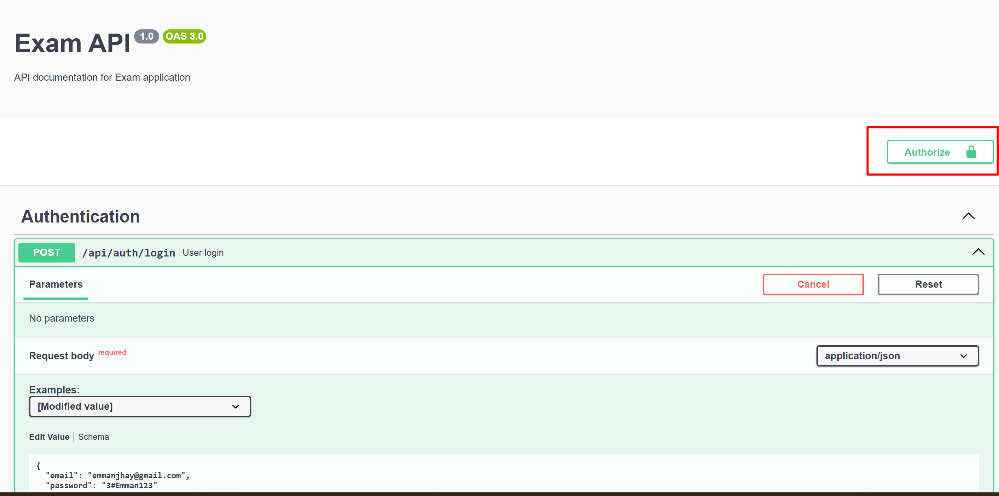

# Exam Project

A NestJS application with task management and bulk CSV upload features.

## Quick Start

1. **Install dependencies:**

```bash
npm install
```

2. **Configure environment:**

```bash
cp .env.example .env
```

Edit `.env` if needed (default values work for local development).

3. **Start services:**

```bash
docker-compose up -d
```

4. **Setup S3 bucket:**

```powershell
# Windows PowerShell
.\scripts\setup-s3.ps1
```

```bash
# Linux/Mac/Git Bash
bash scripts/setup-s3.sh
```

5. **Run migrations:**

```bash
npm run migration:run
```

6. **Start the application:**

```bash
npm run start:dev
```

Access the application at `http://localhost:3000`

Access Swagger documentation at `http://localhost:3000/swagger`

---

## Features

### Authentication

- Register and login via `/auth/register` and `/auth/login`
- JWT token-based authentication
- Use the token in Swagger by clicking "Authorize"
- check the screenshot below
  

### Task Management

- Create, read, update, delete tasks
- Pagination support
- Task statuses: `pending`, `in-progress`, `done`

### Bulk Task Upload (CSV)

Upload a CSV file to create multiple tasks at once.

**CSV Format:**

```csv
title,description,status
"Complete documentation","Write API docs",pending
"Code review","Review PRs",in-progress
```

- **title** (required): Task title
- **description** (optional): Task description
- **status** (optional): `pending`, `in-progress`, or `done`

**Usage:**

1. Get auth token from login
2. POST to `/tasks/bulk-upload` with CSV file
3. Review response with success/error details

**Testing with Sample CSV:**

A ready-to-use sample file `sample-tasks.csv` is included in the root directory with 10 sample tasks. You can upload it directly to test the bulk upload feature.

```bash
# View the sample file
cat sample-tasks.csv
```

---

## Development Commands

```bash
# Start in development mode
npm run start:dev

# Run tests
npm run test

# View logs
docker-compose logs -f

# Stop services
docker-compose down

# Fresh start (removes data)
docker-compose down -v
```

## Database Migrations

```bash
# Run migrations
npm run migration:run

# Revert last migration
npm run migration:revert

# Generate new migration
npm run migration:generate src/migrations/MigrationName
```

---

## Configuration

Default database connection (when using docker-compose):

- **Host**: localhost
- **Port**: 5432
- **Database**: exam_db
- **User**: postgres
- **Password**: postgres

S3 storage uses LocalStack (compatible with AWS S3) at `http://localhost:4566`

---

## Assumptions & Design Decisions

### Assumptions Made

**Authentication & Users:**

- Email addresses are unique identifiers for login
- Users have roles: `admin` or `user` (default: `user`)
- JWT tokens expire after 1 day
- Passwords are hashed using bcrypt

**Task Management:**

- Users can only view and manage their own tasks
- Tasks have three statuses: `pending`, `in-progress`, `done`
- Default status is `pending`
- Deleting a user deletes all their tasks (cascade)

**CSV Bulk Upload:**

- Fixed CSV format: `title,description,status` with header row
- Title is required; description and status are optional
- Invalid status defaults to `pending`
- Partial success allowed (valid rows processed even if some fail)
- Files stored in S3 with timestamp-based naming

**Database:**

- UUID primary keys
- TypeORM auto-manages timestamps
- Relationships: User has many Tasks (one-to-many)

### Key Trade-offs

**JWT Authentication**

- ✅ Stateless, scalable
- ❌ Cannot revoke before expiration

**Synchronous CSV Processing**

- ✅ Simple, immediate feedback
- ❌ Large files may timeout

**LocalStack for S3**

- ✅ Free local development
- ❌ Additional Docker service needed

**Repository Pattern**

- ✅ Easier to test and mock
- ❌ Extra abstraction layer
